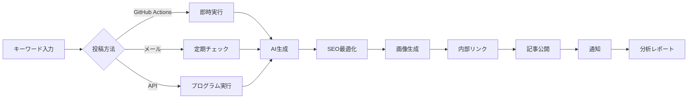

# 📅 ブログ自動投稿 ワークフロー＆スケジュール管理

## 🔄 システム全体のワークフロー



## 📆 スケジュール投稿システム

### 1. 週間投稿カレンダー

| 曜日 | 時間 | テーマ | ターゲット | 本能 |
|------|------|--------|-----------|------|
| 月曜 | 7:00 | 週始めの戦略 | 経営者・マネージャー | hierarchy（地位向上） |
| 火曜 | 12:00 | 実践テクニック | 実務担当者 | learning（学習欲） |
| 水曜 | 7:00 | データ分析 | アナリスト | survival（生存欲） |
| 木曜 | 15:00 | 最新トレンド | イノベーター | territorial（競争優位） |
| 金曜 | 10:00 | 成功事例 | 意思決定者 | hierarchy（地位向上） |

### 2. Google Sheetsでの管理

```
スプレッドシート構成:
| 投稿日 | キーワード | カテゴリー | 優先度 | ステータス | URL |
|--------|-----------|------------|--------|-----------|-----|
| 月曜日 | AI戦略立案 | AIマーケ | 高 | 予定 | - |
| 火曜日 | LP改善手法 | 実践技術 | 中 | 予定 | - |
```

### 3. 自動実行スクリプト（GAS）

```javascript
// 毎朝6時に実行
function dailyBlogScheduler() {
  const sheet = SpreadsheetApp.getActiveSheet();
  const today = new Date().getDay();
  const todaysPosts = getTodaysSchedule(sheet, today);
  
  todaysPosts.forEach(post => {
    if (post.status === '予定') {
      triggerBlogGeneration(post);
      updateStatus(sheet, post.row, '処理中');
    }
  });
}
```

## 🎯 コンテンツ戦略フロー

### フェーズ1: 企画（月初）
```
1. キーワードリサーチ
   - Google Trends分析
   - 競合サイト調査
   - 検索ボリューム確認

2. 月間テーマ設定
   - 第1週: 基礎知識
   - 第2週: 実践方法
   - 第3週: 事例紹介
   - 第4週: 応用・発展
```

### フェーズ2: 生成（週次）
```
1. バッチ生成（日曜夜）
   - 翌週分を一括生成
   - レビュー用ドラフト作成

2. 品質チェック
   - SEOスコア確認
   - 事実確認
   - リンク確認
```

### フェーズ3: 公開（日次）
```
1. 自動公開
   - 予定時刻に自動投稿
   - SNS自動シェア

2. 効果測定
   - PV/UU追跡
   - 滞在時間分析
   - CVR測定
```

## 🔧 高度な自動化設定

### 1. GitHub Actions ワークフロー

```yaml
name: 📅 定期ブログ投稿

on:
  schedule:
    # 毎日朝7時（JST）
    - cron: '0 22 * * *'
  workflow_dispatch:

jobs:
  generate-blog:
    runs-on: ubuntu-latest
    steps:
      - name: 今日の投稿を確認
        id: check-schedule
        run: |
          DAY=$(date +%A)
          echo "today=$DAY" >> $GITHUB_OUTPUT
          
      - name: キーワード取得
        id: get-keyword
        run: |
          # Google Sheetsから今日のキーワードを取得
          KEYWORD=$(curl -s "${{ secrets.SHEET_API_URL }}")
          echo "keyword=$KEYWORD" >> $GITHUB_OUTPUT
          
      - name: ブログ生成
        if: steps.get-keyword.outputs.keyword != ''
        uses: ./.github/actions/generate-blog
        with:
          keyword: ${{ steps.get-keyword.outputs.keyword }}
          api-key: ${{ secrets.CLAUDE_API_KEY }}
```

### 2. メール自動応答システム

```javascript
// Gmail + GAS 連携
function processEmailRequests() {
  const threads = GmailApp.search('subject:"ブログ投稿" is:unread');
  
  threads.forEach(thread => {
    const message = thread.getMessages()[0];
    const content = message.getPlainBody();
    
    // キーワード抽出
    const keyword = extractKeyword(content);
    const schedule = extractSchedule(content);
    
    if (keyword) {
      if (schedule === 'immediate') {
        // 即時投稿
        generateBlogPost(keyword);
      } else {
        // スケジュール登録
        addToSchedule(keyword, schedule);
      }
      
      // 確認メール送信
      message.reply(`ブログ投稿を受け付けました。\nキーワード: ${keyword}\n投稿予定: ${schedule}`);
    }
    
    thread.markRead();
  });
}
```

### 3. Slack連携通知

```javascript
// 投稿完了通知
function notifySlack(post) {
  const webhook = process.env.SLACK_WEBHOOK_URL;
  const message = {
    text: "新しいブログが公開されました！",
    attachments: [{
      color: "good",
      title: post.title,
      title_link: post.url,
      fields: [
        { title: "カテゴリー", value: post.category, short: true },
        { title: "文字数", value: post.wordCount, short: true },
        { title: "SEOスコア", value: post.seoScore, short: true }
      ],
      footer: "LeadFive Blog System",
      ts: Date.now() / 1000
    }]
  };
  
  fetch(webhook, {
    method: 'POST',
    body: JSON.stringify(message)
  });
}
```

## 📊 パフォーマンストラッキング

### 1. 自動レポート生成

```javascript
// 週次レポート
function generateWeeklyReport() {
  const posts = getWeeksPosts();
  const metrics = {
    totalPosts: posts.length,
    totalViews: posts.reduce((sum, p) => sum + p.views, 0),
    avgEngagement: calculateAvgEngagement(posts),
    topPost: posts.sort((a, b) => b.views - a.views)[0],
    keywords: extractTopKeywords(posts)
  };
  
  const report = createReport(metrics);
  sendReportEmail(report);
}
```

### 2. A/Bテスト自動化

```javascript
// タイトルA/Bテスト
function abTestTitles(keyword) {
  const titleA = generateTitle(keyword, 'emotional');
  const titleB = generateTitle(keyword, 'logical');
  
  // 50%ずつ振り分け
  const useA = Math.random() > 0.5;
  const selectedTitle = useA ? titleA : titleB;
  
  // 結果を記録
  trackABTest({
    keyword,
    variant: useA ? 'A' : 'B',
    title: selectedTitle
  });
  
  return selectedTitle;
}
```

## 🚀 ベストプラクティス

### 1. コンテンツカレンダー戦略

```
月間テーマ例（12月）:
第1週: 2025年のAIトレンド予測
第2週: 年末の振り返りと改善点
第3週: 来年の計画立案方法
第4週: 新年の目標設定
```

### 2. 緊急投稿フロー

```
トレンド発生時:
1. Googleトレンド急上昇を検知
2. 関連キーワードで即座に記事生成
3. 1時間以内に公開
4. SNSで拡散
```

### 3. 品質管理チェックリスト

- [ ] SEOスコア80点以上
- [ ] 内部リンク3本以上
- [ ] 画像alt属性設定
- [ ] メタディスクリプション最適化
- [ ] モバイル表示確認
- [ ] 表示速度3秒以内

## 🔍 分析と改善

### 月次振り返りテンプレート

```markdown
## 2024年12月 ブログパフォーマンス

### 📊 全体指標
- 投稿数: 25記事
- 総PV: 45,000
- 平均滞在時間: 3:24
- CVR: 2.3%

### 🎯 トップパフォーマー
1. 「ChatGPTで売上3倍」- 8,500PV
2. 「AI活用の落とし穴」- 6,200PV
3. 「2025年の準備」- 5,800PV

### 💡 改善点
- 火曜日の投稿時間を12時→10時に変更
- 事例系コンテンツを週2回に増加
- 画像をより具体的なものに差し替え

### 📅 来月の計画
- 新年特集シリーズ（5記事）
- インタビュー記事の追加
- 動画コンテンツとの連携
```

## 🎉 成功指標

### KPI設定
- **量的指標**: 月間100記事生成
- **質的指標**: 平均SEOスコア85点
- **効果指標**: オーガニック流入200%増
- **効率指標**: 記事作成時間90%削減

これらの自動化により、高品質なコンテンツを継続的に提供し、ビジネス成長を加速させます。