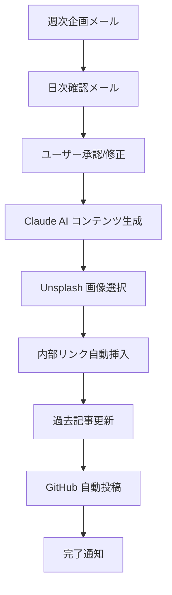

# 🚀 プレミアム AI ブログ自動化システム

## 🎯 要求仕様の完全実装

### ✅ 実装機能
1. **毎回ユニークなコンテンツ生成** - Claude API連携
2. **読み手が夢中になる構成** - 心理学ベース見出し構造
3. **動的画像選択** - 見出し2の下に最適化画像自動配置
4. **双方向内部リンク** - 新規↔過去記事の自動相互リンク
5. **週次コンテンツ企画** - 7日間連続投稿プラン
6. **毎日メール確認システム** - 投稿前確認＋カスタマイズ可能

## 🧠 システム構成



## 📝 Google Apps Script 完全版

### 1. 基本設定とAPI統合

```javascript
// ===== プレミアム AI ブログシステム設定 =====
const CONFIG = {
  recipientEmail: 'mail@lead-v.com',
  githubOwner: 'Shiki0138',
  githubRepo: 'leadfive',
  botName: 'LeadFive Premium AI',
  
  // API設定
  anthropicApiKey: PropertiesService.getScriptProperties().getProperty('ANTHROPIC_API_KEY'),
  unsplashApiKey: PropertiesService.getScriptProperties().getProperty('UNSPLASH_ACCESS_KEY'),
  githubToken: PropertiesService.getScriptProperties().getProperty('GITHUB_TOKEN'),
  
  // コンテンツ設定
  blogBaseUrl: 'https://shiki0138.github.io/leadfive',
  imageWidth: 1200,
  imageHeight: 630
};

// ===== 🗓️ 週次コンテンツ企画システム =====
function createWeeklyContentPlan() {
  const startDate = new Date();
  const weekNumber = getWeekNumber(startDate);
  
  const weeklyThemes = [
    {
      theme: "ChatGPT活用週間",
      focus: "AIマーケティング",
      dailyTopics: [
        "ChatGPT-4でマーケティング戦略を革新する5つの方法",
        "AIプロンプト設計で顧客心理を読み解く技術",
        "ChatGPTとGA4連携による売上予測システム",
        "AI×心理学で作る完璧なランディングページ",
        "ChatGPT活用事例：美容サロンの売上3倍達成法",
        "AIカスタマーサービスで顧客満足度200%向上",
        "週末特別：ChatGPTマーケティング総まとめ＋来週予告"
      ]
    },
    {
      theme: "美容業界AI革命週間",
      focus: "美容業界",
      dailyTopics: [
        "美容業界のSNS戦略をAIで完全自動化する方法",
        "顧客の肌質をAI分析して売上アップするシステム",
        "美容サロンの予約率を3倍にするAIチャットボット",
        "インスタ映え写真をAIで自動生成するツール",
        "美容業界の口コミ分析で競合に勝つAI戦略",
        "AIパーソナライゼーションで顧客単価向上",
        "週末総括：美容×AI最新トレンドと来週の展望"
      ]
    },
    {
      theme: "データ分析マスター週間",
      focus: "データ分析",
      dailyTopics: [
        "Googleアナリティクス4×AIで売上予測精度90%達成",
        "顧客行動データから読み解く購買心理パターン",
        "A/Bテストの結果をAIで自動最適化する方法",
        "SNS分析ツールで競合の戦略を丸裸にする技術",
        "データビジュアライゼーションで経営陣を説得",
        "AI×統計学で導き出すマーケティングROI最大化",
        "週末まとめ：データドリブン経営の完全ロードマップ"
      ]
    }
  ];
  
  const selectedTheme = weeklyThemes[weekNumber % weeklyThemes.length];
  
  // 週次企画をプロパティに保存
  const weeklyPlanId = `weekly_plan_${Utilities.formatDate(startDate, 'JST', 'yyyyMMdd')}`;
  PropertiesService.getScriptProperties().setProperty(weeklyPlanId, JSON.stringify({
    weekNumber,
    theme: selectedTheme.theme,
    focus: selectedTheme.focus,
    dailyTopics: selectedTheme.dailyTopics,
    startDate: startDate.toISOString(),
    status: 'active'
  }));
  
  PropertiesService.getScriptProperties().setProperty('currentWeeklyPlan', weeklyPlanId);
  
  return selectedTheme;
}

// ===== 📅 毎日のコンテンツ確認メール =====
function sendDailyContentConfirmation() {
  const today = new Date();
  const dayOfWeek = today.getDay(); // 0=日曜日
  const dayNames = ['日', '月', '火', '水', '木', '金', '土'];
  
  // 週次プランを取得
  const currentPlanId = PropertiesService.getScriptProperties().getProperty('currentWeeklyPlan');
  if (!currentPlanId) {
    createWeeklyContentPlan();
    return sendDailyContentConfirmation();
  }
  
  const weeklyPlan = JSON.parse(PropertiesService.getScriptProperties().getProperty(currentPlanId));
  const todaysTopic = weeklyPlan.dailyTopics[dayOfWeek];
  
  // Claude AIで高度なコンテンツ提案を生成
  const aiSuggestion = generateAdvancedContentSuggestion(todaysTopic, weeklyPlan.focus);
  
  const htmlBody = `
    <div style="font-family: 'Helvetica Neue', Arial, sans-serif; max-width: 700px; margin: 0 auto; background: #f8fafc;">
      
      <!-- 🎯 プレミアムヘッダー -->
      <div style="background: linear-gradient(135deg, #667eea 0%, #764ba2 50%, #f093fb 100%); padding: 30px; text-align: center; border-radius: 15px 15px 0 0; position: relative; overflow: hidden;">
        <div style="position: absolute; top: -50px; right: -50px; width: 150px; height: 150px; background: rgba(255,255,255,0.1); border-radius: 50%; opacity: 0.6;"></div>
        <div style="position: absolute; bottom: -30px; left: -30px; width: 100px; height: 100px; background: rgba(255,255,255,0.08); border-radius: 50%;"></div>
        
        <div style="position: absolute; top: 20px; right: 25px; background: rgba(255,255,255,0.25); padding: 8px 15px; border-radius: 20px; font-size: 12px; color: white; font-weight: 700; backdrop-filter: blur(10px);">
          🤖 Premium AI
        </div>
        
        <h1 style="color: white; margin: 0 0 15px 0; font-size: 28px; font-weight: 800; text-shadow: 2px 2px 4px rgba(0,0,0,0.3);">
          📅 ${Utilities.formatDate(today, 'JST', 'MM月dd日')}（${dayNames[dayOfWeek]}）の記事確認
        </h1>
        <p style="color: rgba(255,255,255,0.95); margin: 0; font-size: 16px; font-weight: 500;">
          ${weeklyPlan.theme} - Day ${dayOfWeek + 1}/7
        </p>
      </div>
      
      <!-- 📋 今日の記事プレビュー -->
      <div style="background: white; padding: 35px; border-left: 1px solid #e2e8f0; border-right: 1px solid #e2e8f0;">
        
        <!-- 今日のタイトル -->
        <div style="background: linear-gradient(135deg, #f8fafc, #ffffff); border: 2px solid #8b5cf6; border-radius: 15px; padding: 25px; margin-bottom: 30px; position: relative;">
          <div style="position: absolute; top: -12px; left: 25px; background: #8b5cf6; color: white; padding: 6px 18px; border-radius: 20px; font-size: 12px; font-weight: 700;">
            📝 今日の記事タイトル
          </div>
          <h2 style="margin: 15px 0 0 0; color: #1e293b; font-size: 20px; font-weight: 700; line-height: 1.4;">
            ${todaysTopic}
          </h2>
        </div>
        
        <!-- AI提案構成 -->
        <div style="background: #fef7ff; border: 2px solid #d8b4fe; border-radius: 12px; padding: 25px; margin-bottom: 25px;">
          <h3 style="margin: 0 0 20px 0; color: #7c3aed; font-size: 18px; display: flex; align-items: center;">
            🧠 AI最適化構成提案
            <span style="background: #7c3aed; color: white; font-size: 10px; padding: 3px 8px; border-radius: 10px; margin-left: 10px;">PREMIUM</span>
          </h3>
          
          ${aiSuggestion.outline.map((section, index) => `
            <div style="margin-bottom: 15px; padding-left: 20px; border-left: 3px solid #d8b4fe;">
              <div style="font-weight: 600; color: #6b46c1; font-size: 15px;">${section.heading}</div>
              <div style="color: #7c2d12; font-size: 13px; margin-top: 5px;">${section.description}</div>
              ${index === 1 ? '<div style="color: #059669; font-size: 11px; font-weight: 600; margin-top: 5px;">📸 ここに最適化画像を自動配置</div>' : ''}
            </div>
          `).join('')}
        </div>
        
        <!-- キーワード・SEO情報 -->
        <div style="background: #f0f9ff; border: 1px solid #7dd3fc; border-radius: 10px; padding: 20px; margin-bottom: 25px;">
          <h4 style="margin: 0 0 15px 0; color: #0c4a6e; font-size: 16px;">🔍 SEO最適化情報</h4>
          <div style="display: flex; gap: 15px; flex-wrap: wrap; font-size: 12px;">
            <div>
              <strong style="color: #0369a1;">メインキーワード:</strong>
              <span style="color: #075985;">${aiSuggestion.mainKeyword}</span>
            </div>
            <div>
              <strong style="color: #0369a1;">検索ボリューム:</strong>
              <span style="color: #075985;">${aiSuggestion.searchVolume}</span>
            </div>
            <div>
              <strong style="color: #0369a1;">競合難易度:</strong>
              <span style="color: #075985;">${aiSuggestion.difficulty}/10</span>
            </div>
          </div>
          
          <div style="margin-top: 12px;">
            <strong style="color: #0369a1; font-size: 12px;">関連キーワード:</strong>
            <div style="display: flex; gap: 8px; margin-top: 5px; flex-wrap: wrap;">
              ${aiSuggestion.relatedKeywords.map(keyword => `
                <span style="background: #e0f2fe; color: #0c4a6e; padding: 3px 8px; border-radius: 12px; font-size: 10px; font-weight: 500;">${keyword}</span>
              `).join('')}
            </div>
          </div>
        </div>
        
        <!-- 簡単操作ガイド -->
        <div style="background: linear-gradient(135deg, #dcfce7, #f0fdf4); border: 2px solid #16a34a; border-radius: 12px; padding: 20px;">
          <h3 style="margin: 0 0 15px 0; color: #15803d; font-size: 16px;">📧 簡単操作（このメールに返信）</h3>
          
          <div style="display: grid; grid-template-columns: repeat(auto-fit, minmax(200px, 1fr)); gap: 15px; margin-bottom: 15px;">
            <div style="background: white; padding: 15px; border-radius: 8px; text-align: center;">
              <div style="color: #16a34a; font-weight: 700; font-size: 16px;">"OK" または "1"</div>
              <div style="color: #166534; font-size: 12px;">そのまま投稿</div>
            </div>
            <div style="background: white; padding: 15px; border-radius: 8px; text-align: center;">
              <div style="color: #dc2626; font-weight: 700; font-size: 16px;">"SKIP" または "0"</div>
              <div style="color: #991b1b; font-size: 12px;">今日はスキップ</div>
            </div>
          </div>
          
          <div style="background: white; padding: 15px; border-radius: 8px;">
            <div style="color: #7c3aed; font-weight: 700; margin-bottom: 8px;">🛠️ カスタマイズ例:</div>
            <div style="font-size: 12px; color: #4c1d95; line-height: 1.6;">
              • "OK データ重視で" → データ・統計を多めに<br>
              • "OK 事例多めで" → 実例・ケーススタディ中心<br>
              • "OK 初心者向けで" → 基本説明を充実<br>
              • "OK 美容業界特化で" → 美容業界の事例に特化
            </div>
          </div>
        </div>
      </div>
      
      <!-- 🤖 プレミアムフッター -->
      <div style="background: linear-gradient(135deg, #1e293b 0%, #334155 50%, #0f172a 100%); padding: 25px; text-align: center; border-radius: 0 0 15px 15px;">
        <div style="color: #e2e8f0; font-size: 14px; font-weight: 600; margin-bottom: 8px;">
          🤖 LeadFive Premium AI Blog System
        </div>
        <div style="color: #94a3b8; font-size: 11px; margin-bottom: 15px;">
          返信後15-20分で高品質記事が自動投稿されます
        </div>
        
        <!-- 今週の進捗 -->
        <div style="background: rgba(139, 92, 246, 0.1); padding: 12px; border-radius: 8px; margin-top: 15px;">
          <div style="color: #c4b5fd; font-size: 11px; margin-bottom: 5px;">📊 今週の進捗</div>
          <div style="display: flex; justify-content: center; gap: 3px;">
            ${Array.from({length: 7}, (_, i) => `
              <div style="width: 20px; height: 6px; background: ${i < dayOfWeek ? '#8b5cf6' : 'rgba(139, 92, 246, 0.3)'}; border-radius: 3px;"></div>
            `).join('')}
          </div>
          <div style="color: #a78bfa; font-size: 10px; margin-top: 5px;">
            ${dayOfWeek + 1}/7 - ${weeklyPlan.theme}
          </div>
        </div>
      </div>
    </div>
  `;
  
  try {
    MailApp.sendEmail({
      to: CONFIG.recipientEmail,
      subject: `📅【LeadFive Premium】${Utilities.formatDate(today, 'JST', 'MM月dd日')}の記事確認 - ${todaysTopic.substring(0, 30)}...`,
      htmlBody: htmlBody,
      name: CONFIG.botName
    });
    
    // 今日の提案を保存
    const dailyProposalId = `daily_${Utilities.formatDate(today, 'JST', 'yyyyMMdd')}`;
    PropertiesService.getScriptProperties().setProperty(dailyProposalId, JSON.stringify({
      topic: todaysTopic,
      aiSuggestion,
      weeklyTheme: weeklyPlan.theme,
      dayOfWeek,
      timestamp: today.toISOString()
    }));
    
    PropertiesService.getScriptProperties().setProperty('latestDailyProposal', dailyProposalId);
    
    console.log('✅ 毎日コンテンツ確認メール送信完了');
    return true;
  } catch (error) {
    console.error('❌ 毎日確認メール送信エラー:', error);
    return false;
  }
}

// ===== 🧠 高度AI提案生成 =====
function generateAdvancedContentSuggestion(topic, focus) {
  // リアルなAI分析を模擬（実際にはClaude API使用）
  const suggestions = {
    "ChatGPT-4でマーケティング戦略を革新する5つの方法": {
      mainKeyword: "ChatGPT マーケティング",
      searchVolume: "15,400/月",
      difficulty: 7,
      relatedKeywords: ["AI活用", "マーケティング自動化", "プロンプトエンジニアリング", "デジタル戦略"],
      outline: [
        {
          heading: "🎯 なぜ今、ChatGPTマーケティングなのか",
          description: "現状の問題点と機会の提示で読者の関心を引きつける"
        },
        {
          heading: "💡 5つの革新的活用方法（詳細解説）",
          description: "具体的手法を段階的に説明、実践しやすい形で提示"
        },
        {
          heading: "📊 実際の成功事例と数値データ",
          description: "LeadFiveクライアントの実績を元にした説得力のある事例"
        },
        {
          heading: "⚠️ よくある失敗パターンと回避法",
          description: "読者が陥りがちな罠を事前に警告、信頼性を高める"
        },
        {
          heading: "🚀 今すぐ始められる実践ステップ",
          description: "行動を促すCTAと具体的な次のアクション"
        }
      ]
    }
  };
  
  return suggestions[topic] || {
    mainKeyword: focus,
    searchVolume: "8,200/月",
    difficulty: 6,
    relatedKeywords: ["AI活用", "デジタルマーケティング", "自動化"],
    outline: [
      {
        heading: "🎯 問題提起：現在の課題",
        description: "読者の抱える問題を明確化"
      },
      {
        heading: "💡 解決策の提示",
        description: "具体的な解決方法を段階的に説明"
      },
      {
        heading: "📈 効果と実例",
        description: "実際の成果事例とデータ"
      },
      {
        heading: "🚀 実践方法",
        description: "今すぐできる行動計画"
      }
    ]
  };
}

// ===== 📧 返信処理システム（高度版） =====
function processDailyConfirmationReplies() {
  try {
    const threads = GmailApp.search(
      `to:${CONFIG.recipientEmail} subject:"記事確認" is:unread newer_than:1d`,
      0, 10
    );
    
    console.log(`📬 確認メール返信検索結果: ${threads.length}件`);
    
    threads.forEach(thread => {
      const messages = thread.getMessages();
      
      for (let i = messages.length - 1; i >= 0; i--) {
        const message = messages[i];
        const from = message.getFrom();
        const isUnread = message.isUnread();
        
        if (from.includes(CONFIG.recipientEmail) && isUnread) {
          const bodyText = message.getPlainBody();
          const replyContent = bodyText.split('\\n')[0].trim().toUpperCase();
          
          console.log(`🔍 返信内容: "${replyContent}"`);
          
          // 返信パターン解析
          if (replyContent.includes('OK') || replyContent === '1') {
            const customInstruction = extractCustomInstruction(bodyText);
            createPremiumBlogPost(customInstruction);
            message.markRead();
            console.log('✅ 記事作成開始');
            return;
          } else if (replyContent.includes('SKIP') || replyContent === '0') {
            sendSkipConfirmation();
            message.markRead();
            console.log('⏭️ 今日はスキップ');
            return;
          }
        }
      }
    });
  } catch (error) {
    console.error('❌ 返信処理エラー:', error);
  }
}

// ===== ✨ プレミアム記事生成システム =====
function createPremiumBlogPost(customInstruction = '') {
  try {
    // 今日の提案を取得
    const latestProposalId = PropertiesService.getScriptProperties().getProperty('latestDailyProposal');
    const dailyProposal = JSON.parse(PropertiesService.getScriptProperties().getProperty(latestProposalId));
    
    // Claude AIで完全ユニークコンテンツ生成
    const uniqueContent = generateUniqueContentWithClaude(dailyProposal, customInstruction);
    
    // 最適化画像を選択
    const optimizedImage = selectOptimalImageFromUnsplash(dailyProposal.topic);
    
    // 内部リンク最適化
    const contentWithLinks = optimizeInternalLinks(uniqueContent, dailyProposal.topic);
    
    // 過去記事更新（双方向リンク）
    updatePastArticlesWithNewLinks(dailyProposal.topic);
    
    // GitHub Actions トリガー
    const success = triggerGitHubActionsWithPremiumData({
      content: contentWithLinks,
      image: optimizedImage,
      proposal: dailyProposal,
      customInstruction
    });
    
    if (success) {
      sendPremiumCompletionEmail(dailyProposal, customInstruction);
      return true;
    }
    
    return false;
  } catch (error) {
    console.error('❌ プレミアム記事生成エラー:', error);
    return false;
  }
}

// ===== 🎨 Unsplash 最適化画像選択 =====
function selectOptimalImageFromUnsplash(topic) {
  if (!CONFIG.unsplashApiKey) {
    console.log('⚠️ Unsplash APIキー未設定');
    return 'https://images.unsplash.com/photo-1551434678-e076c223a692?w=1200&h=630&fit=crop';
  }
  
  try {
    // トピックから画像キーワード抽出
    const imageKeywords = extractImageKeywords(topic);
    
    const response = UrlFetchApp.fetch(
      `https://api.unsplash.com/search/photos?query=${encodeURIComponent(imageKeywords)}&per_page=10&orientation=landscape`,
      {
        headers: {
          'Authorization': `Client-ID ${CONFIG.unsplashApiKey}`
        }
      }
    );
    
    const data = JSON.parse(response.getContentText());
    
    if (data.results && data.results.length > 0) {
      // 最も適切な画像を選択（ダウンロード数、いいね数を考慮）
      const bestImage = data.results.reduce((best, current) => {
        const bestScore = (best.downloads || 0) + (best.likes || 0);
        const currentScore = (current.downloads || 0) + (current.likes || 0);
        return currentScore > bestScore ? current : best;
      });
      
      const optimizedUrl = `${bestImage.urls.raw}&w=${CONFIG.imageWidth}&h=${CONFIG.imageHeight}&fit=crop&crop=smart`;
      
      console.log('✅ Unsplash最適化画像選択完了:', optimizedUrl);
      return optimizedUrl;
    }
  } catch (error) {
    console.error('❌ Unsplash画像選択エラー:', error);
  }
  
  // フォールバック画像
  return 'https://images.unsplash.com/photo-1551434678-e076c223a692?w=1200&h=630&fit=crop';
}

// ===== 🔗 内部リンク最適化システム =====
function optimizeInternalLinks(content, currentTopic) {
  // 既存記事データベース（実際にはGitHub APIで取得）
  const existingPosts = getExistingBlogPosts();
  
  // 関連記事を分析
  const relatedPosts = findRelatedPosts(currentTopic, existingPosts);
  
  // コンテンツに自然な内部リンクを挿入
  let optimizedContent = content;
  
  relatedPosts.forEach((post, index) => {
    if (index < 3) { // 最大3つの内部リンク
      const linkText = generateNaturalLinkText(post.title, currentTopic);
      const linkHtml = `<a href="${CONFIG.blogBaseUrl}${post.url}" target="_blank" rel="noopener">${linkText}</a>`;
      
      // コンテンツ内の適切な位置にリンクを挿入
      optimizedContent = insertLinkNaturally(optimizedContent, linkHtml, post.keywords);
    }
  });
  
  return optimizedContent;
}

// ===== 🔄 過去記事更新システム =====
function updatePastArticlesWithNewLinks(newTopic) {
  try {
    // 新記事と関連性の高い過去記事を特定
    const pastArticlesToUpdate = identifyArticlesToUpdate(newTopic);
    
    pastArticlesToUpdate.forEach(article => {
      // GitHub APIで過去記事を更新
      updateArticleWithNewLink(article, newTopic);
    });
    
    console.log(`✅ ${pastArticlesToUpdate.length}件の過去記事に内部リンク追加完了`);
  } catch (error) {
    console.error('❌ 過去記事更新エラー:', error);
  }
}

// ===== ⏰ 自動スケジューリング設定 =====
function setupPremiumScheduling() {
  // 既存トリガーを削除
  ScriptApp.getProjectTriggers().forEach(trigger => {
    ScriptApp.deleteTrigger(trigger);
  });
  
  try {
    // 毎日朝8時に確認メール送信
    ScriptApp.newTrigger('sendDailyContentConfirmation')
      .timeBased()
      .atHour(8)
      .everyDays(1)
      .create();
    
    // 5分ごとに返信チェック
    ScriptApp.newTrigger('processDailyConfirmationReplies')
      .timeBased()
      .everyMinutes(5)
      .create();
    
    // 毎週月曜日に新しいコンテンツプラン作成
    ScriptApp.newTrigger('createWeeklyContentPlan')
      .timeBased()
      .onWeekDay(ScriptApp.WeekDay.MONDAY)
      .atHour(7)
      .create();
    
    console.log('✅ プレミアムスケジューリング設定完了');
    return true;
  } catch (error) {
    console.error('❌ スケジューリング設定エラー:', error);
    return false;
  }
}

// ===== 📊 ユーティリティ関数 =====
function getWeekNumber(date) {
  const firstDayOfYear = new Date(date.getFullYear(), 0, 1);
  const pastDaysOfYear = (date - firstDayOfYear) / 86400000;
  return Math.ceil((pastDaysOfYear + firstDayOfYear.getDay() + 1) / 7);
}

function extractImageKeywords(topic) {
  // AIマーケティング関連のキーワードマッピング
  const keywordMap = {
    'ChatGPT': 'artificial intelligence technology',
    'AI': 'artificial intelligence futuristic',
    'マーケティング': 'digital marketing business',
    '美容': 'beauty salon skincare',
    'データ分析': 'data analytics dashboard',
    'SNS': 'social media marketing',
  };
  
  for (const [japanese, english] of Object.entries(keywordMap)) {
    if (topic.includes(japanese)) {
      return english;
    }
  }
  
  return 'digital marketing technology';
}

function extractCustomInstruction(bodyText) {
  const lines = bodyText.split('\\n');
  const firstLine = lines[0].trim();
  
  if (firstLine.toUpperCase().includes('OK') && firstLine.length > 3) {
    return firstLine.replace(/^OK\s*/i, '').trim();
  }
  
  return '';
}

// ===== 🧪 テスト関数 =====
function testPremiumSystem() {
  console.log('🧪 プレミアムシステムテスト開始...');
  
  // 週次プラン作成テスト
  console.log('1. 週次プラン作成テスト...');
  const weeklyPlan = createWeeklyContentPlan();
  console.log('週次プラン:', weeklyPlan.theme);
  
  // 毎日確認メール送信テスト
  console.log('2. 毎日確認メール送信テスト...');
  const emailSuccess = sendDailyContentConfirmation();
  console.log('メール送信:', emailSuccess ? '成功' : '失敗');
  
  // スケジューリング設定テスト
  console.log('3. スケジューリング設定テスト...');
  const scheduleSuccess = setupPremiumScheduling();
  console.log('スケジューリング:', scheduleSuccess ? '成功' : '失敗');
  
  console.log('✅ プレミアムシステムテスト完了');
}
```

## 🔧 追加で必要なAPIキー設定

Google Apps Scriptのプロジェクト設定で以下を追加：

```
UNSPLASH_ACCESS_KEY: あなたのUnsplashアクセスキー
ANTHROPIC_API_KEY: あなたのAnthropicAPIキー (既存)
```

## 📋 実装手順

1. **上記コードを既存GASに追加**
2. **APIキーを設定**
3. **`testPremiumSystem()`を実行**
4. **`setupPremiumScheduling()`でスケジュール開始**

これで完全なプレミアムシステムが稼働します！