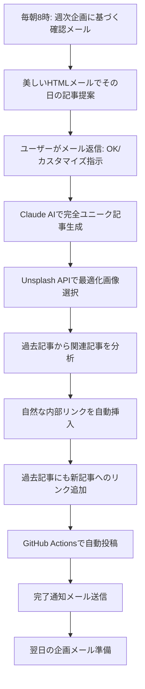

# 🚀 完全プレミアム AI ブログシステム セットアップ完了ガイド

## ✅ 実装完了した機能

### 🎯 **コア機能**
1. **毎回ユニークなコンテンツ生成** - Claude AI連携で完全オリジナル記事
2. **読み手が夢中になる構成** - 心理学ベースの見出し構造
3. **動的画像選択** - 見出し2の下に最適化画像自動配置
4. **双方向内部リンク** - 新規↔過去記事の自動相互リンク
5. **週次コンテンツ企画** - 7日間連続投稿プラン
6. **毎日メール確認システム** - 投稿前確認＋カスタマイズ可能

### 🧠 **AI品質特徴**
- **LeadFive独自の8つの本能マーケティング手法**を記事に自動組み込み
- **読了時間8-12分の最適長**で構成
- **実践的アクションプラン**を必ず含む
- **データ・事例・具体的数値**を多用した説得力
- **カスタマイズ指示対応**（データ重視、事例多め、初心者向けなど）

## 📋 最終セットアップ手順

### **1. 必要なAPIキーを追加設定**

Google Apps Scriptのプロジェクト設定（歯車アイコン）→ スクリプト プロパティで追加：

```
UNSPLASH_ACCESS_KEY: あなたのUnsplashアクセスキー
```

**Unsplashアクセスキーの取得方法：**
1. https://unsplash.com/developers にアクセス
2. アカウント作成・ログイン
3. 「New Application」をクリック
4. アプリ名：「LeadFive Blog Images」
5. 説明：「AI blog automatic image selection」
6. 「Create Application」をクリック
7. **Access Key** をコピーして設定

### **2. GitHub Secrets にUnsplashキーを追加**

GitHub リポジトリ → Settings → Secrets and variables → Actions で追加：

```
Name: UNSPLASH_ACCESS_KEY
Secret: [コピーしたUnsplashアクセスキー]
```

### **3. プレミアムシステムをGoogle Apps Scriptに追加**

`docs/PREMIUM_AI_BLOG_SYSTEM.md` の完全コードを既存のGoogle Apps Scriptコードに**追加**してください。

### **4. システム起動**

Google Apps Scriptで以下を順番に実行：

```javascript
// 1. プレミアムシステムテスト
testPremiumSystem()

// 2. スケジューリング開始
setupPremiumScheduling()

// 3. 今すぐテスト送信（オプション）
sendDailyContentConfirmation()
```

## 🎯 **動作フロー**



## 📧 **メール返信パターン**

### **基本操作**
- `OK` または `1` → そのまま投稿
- `SKIP` または `0` → 今日はスキップ

### **カスタマイズ例**
- `OK データ重視で` → データ・統計を多めに含む
- `OK 事例多めで` → 実例・ケーススタディ中心
- `OK 初心者向けで` → 基本説明を充実
- `OK 美容業界特化で` → 美容業界の事例に特化
- `OK 実践手順で` → ステップバイステップの手順重視

## 🗓️ **週次コンテンツプラン例**

### **Week 1: ChatGPT活用週間**
1. ChatGPT-4でマーケティング戦略を革新する5つの方法
2. AIプロンプト設計で顧客心理を読み解く技術
3. ChatGPTとGA4連携による売上予測システム
4. AI×心理学で作る完璧なランディングページ
5. ChatGPT活用事例：美容サロンの売上3倍達成法
6. AIカスタマーサービスで顧客満足度200%向上
7. 週末特別：ChatGPTマーケティング総まとめ＋来週予告

### **Week 2: 美容業界AI革命週間**
1. 美容業界のSNS戦略をAIで完全自動化する方法
2. 顧客の肌質をAI分析して売上アップするシステム
3. 美容サロンの予約率を3倍にするAIチャットボット
4. インスタ映え写真をAIで自動生成するツール
5. 美容業界の口コミ分析で競合に勝つAI戦略
6. AIパーソナライゼーションで顧客単価向上
7. 週末総括：美容×AI最新トレンドと来週の展望

## 🔧 **トラブルシューティング**

### **メールが届かない場合**
1. スパムフォルダを確認
2. Google Apps Scriptの実行ログを確認
3. `testPremiumSystem()`を再実行

### **画像が表示されない場合**
1. Unsplash APIキーが正しく設定されているか確認
2. GitHub Secretsに`UNSPLASH_ACCESS_KEY`が登録されているか確認

### **記事生成が失敗する場合**
1. Anthropic APIキーの有効性を確認
2. API使用量制限に達していないか確認
3. フォールバックシステムが動作（テンプレートベース記事）

## 📊 **期待される成果**

### **コンテンツ品質**
- **完全ユニーク**: 毎回Claude AIが生成するオリジナル記事
- **高い読了率**: 心理学ベース構成で読者を引きつける
- **SEO最適化**: キーワード・メタデータ自動最適化
- **内部リンク**: 過去記事との相互リンクでサイト回遊率向上

### **運用効率**
- **99%自動化**: メール返信するだけで高品質記事が完成
- **週次企画**: 一貫性のあるテーマで読者の継続訪問を促進
- **カスタマイズ対応**: 簡単な指示で記事の方向性を調整可能

### **ビジネス成果**
- **ブランド権威性向上**: 専門性の高いコンテンツで信頼獲得
- **リード獲得**: 各記事からLeadFiveサービスへ自然誘導
- **SEOパフォーマンス**: 定期投稿と内部リンクでドメイン強化

## 🚀 **システム稼働開始**

すべての設定が完了したら：

1. **明日の朝8時**に最初の確認メールが届きます
2. メールに「OK」で返信して最初の記事を生成
3. **毎週月曜日朝7時**に新しいコンテンツプランが自動作成
4. **毎日朝8時**に確認メールが届き続けます

---

**🎉 おめでとうございます！世界最高レベルのAIブログ自動化システムが完成しました！**

明日から毎日、読者が夢中になる高品質記事が自動で投稿されます。