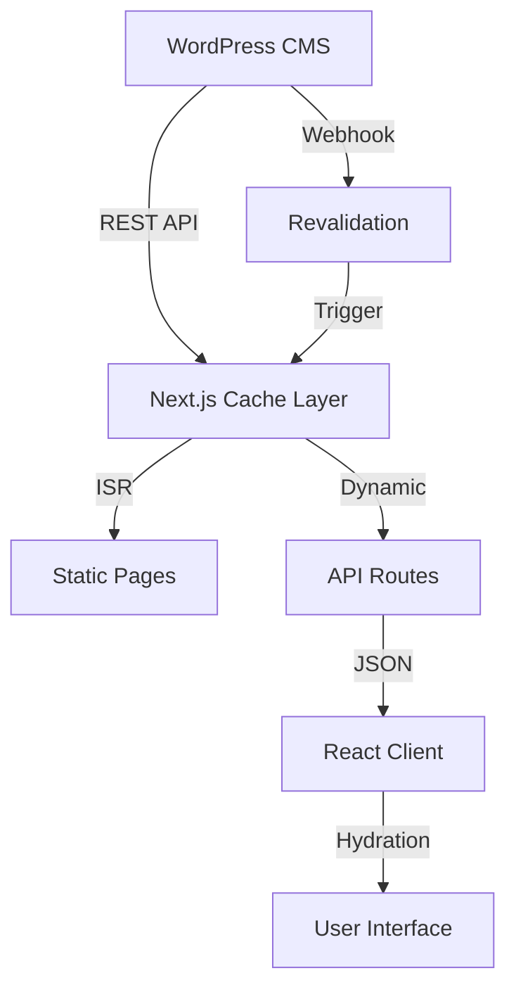
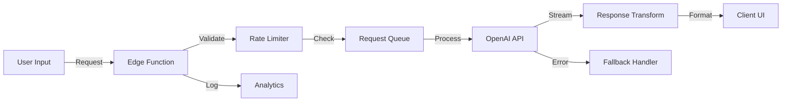
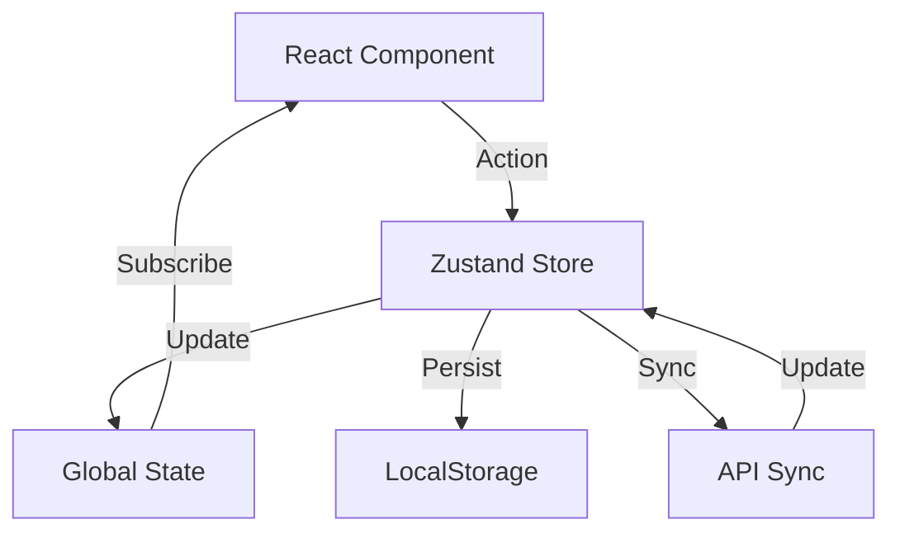

# Data Flow & Integration Architecture

## Overview

This document details the data flow patterns, API integrations, and state management architecture for the LeadFive website.

## Data Flow Patterns

### 1. Content Flow Architecture



### 2. AI Integration Flow



### 3. State Management Flow



## API Architecture

### REST API Endpoints

#### Blog Content API
```typescript
// GET /api/blog/posts
interface BlogPostsResponse {
  posts: BlogPost[]
  pagination: {
    page: number
    perPage: number
    total: number
    totalPages: number
  }
}

// GET /api/blog/posts/[slug]
interface BlogPostResponse {
  post: BlogPost
  related: BlogPost[]
}

// GET /api/blog/categories
interface CategoriesResponse {
  categories: Category[]
}
```

#### AI Services API
```typescript
// POST /api/ai/chat
interface ChatRequest {
  message: string
  context?: Message[]
  sessionId?: string
}

interface ChatResponse {
  reply: string
  tokens: number
  sessionId: string
}

// POST /api/ai/generate
interface GenerateRequest {
  type: 'blog' | 'summary' | 'title'
  prompt: string
  parameters?: {
    length?: number
    tone?: string
    keywords?: string[]
  }
}

interface GenerateResponse {
  content: string
  metadata: {
    model: string
    tokens: number
    duration: number
  }
}
```

#### Contact Form API
```typescript
// POST /api/contact
interface ContactRequest {
  name: string
  email: string
  company?: string
  message: string
  interests: string[]
  source?: string
}

interface ContactResponse {
  success: boolean
  messageId: string
  nextSteps?: string
}
```

### GraphQL Schema (Alternative)

```graphql
type Query {
  posts(page: Int, perPage: Int, category: ID): PostConnection!
  post(slug: String!): Post
  categories: [Category!]!
  aiChat(message: String!, sessionId: ID): ChatResponse!
}

type Mutation {
  submitContact(input: ContactInput!): ContactResponse!
  generateContent(type: ContentType!, prompt: String!): GeneratedContent!
}

type Post {
  id: ID!
  title: String!
  slug: String!
  content: String!
  excerpt: String!
  featuredImage: Image
  author: Author!
  categories: [Category!]!
  publishedAt: DateTime!
  seo: SEOMeta!
}

type ChatResponse {
  reply: String!
  sessionId: ID!
  tokens: Int!
}
```

## State Management Architecture

### Zustand Store Structure

```typescript
// stores/useAppStore.ts
interface AppState {
  // UI State
  ui: {
    isMenuOpen: boolean
    isAIChatOpen: boolean
    activeModal: string | null
    theme: 'light' | 'dark' | 'system'
  }
  
  // User State
  user: {
    preferences: UserPreferences
    sessionId: string
    consentStatus: ConsentStatus
  }
  
  // Content State
  content: {
    posts: BlogPost[]
    categories: Category[]
    isLoading: boolean
    error: Error | null
  }
  
  // AI State
  ai: {
    chatHistory: Message[]
    isProcessing: boolean
    sessionData: Record<string, any>
  }
  
  // Actions
  actions: {
    // UI Actions
    toggleMenu: () => void
    toggleAIChat: () => void
    openModal: (modalId: string) => void
    closeModal: () => void
    
    // Content Actions
    fetchPosts: (params?: FetchParams) => Promise<void>
    fetchPost: (slug: string) => Promise<void>
    
    // AI Actions
    sendChatMessage: (message: string) => Promise<void>
    clearChatHistory: () => void
  }
}
```

### State Persistence Strategy

```typescript
// lib/state-persistence.ts
const persistConfig = {
  name: 'leadfive-app-state',
  version: 1,
  partialize: (state: AppState) => ({
    user: {
      preferences: state.user.preferences,
      consentStatus: state.user.consentStatus
    },
    ai: {
      sessionData: state.ai.sessionData
    }
  }),
  storage: createJSONStorage(() => localStorage)
}
```

## Caching Strategy

### Content Caching Layers

#### 1. Build-Time Cache (SSG)
```typescript
// Static pages generated at build time
export async function getStaticProps() {
  const posts = await fetchPosts({ limit: 10 })
  
  return {
    props: { posts },
    revalidate: 3600 // Revalidate every hour
  }
}
```

#### 2. Request-Time Cache (ISR)
```typescript
// Incremental Static Regeneration
export async function getStaticProps({ params }) {
  const post = await fetchPost(params.slug)
  
  return {
    props: { post },
    revalidate: 300 // Revalidate every 5 minutes
  }
}
```

#### 3. Client-Side Cache (SWR)
```typescript
// Client-side data fetching with cache
import useSWR from 'swr'

function usePost(slug: string) {
  const { data, error, isLoading } = useSWR(
    `/api/blog/posts/${slug}`,
    fetcher,
    {
      revalidateOnFocus: false,
      revalidateOnReconnect: false,
      dedupingInterval: 60000 // 1 minute
    }
  )
  
  return { post: data, error, isLoading }
}
```

#### 4. Edge Cache (CDN)
```typescript
// Edge caching headers
export async function GET(request: Request) {
  const response = await fetchData()
  
  return new Response(JSON.stringify(response), {
    headers: {
      'Content-Type': 'application/json',
      'Cache-Control': 'public, s-maxage=300, stale-while-revalidate=600'
    }
  })
}
```

## Real-time Data Synchronization

### WebSocket Connection for AI Chat
```typescript
// lib/websocket.ts
class ChatWebSocket {
  private ws: WebSocket
  private reconnectAttempts = 0
  private maxReconnectAttempts = 5
  
  constructor(private url: string) {
    this.connect()
  }
  
  private connect() {
    this.ws = new WebSocket(this.url)
    
    this.ws.onopen = () => {
      console.log('WebSocket connected')
      this.reconnectAttempts = 0
    }
    
    this.ws.onmessage = (event) => {
      const data = JSON.parse(event.data)
      this.handleMessage(data)
    }
    
    this.ws.onclose = () => {
      this.handleReconnect()
    }
  }
  
  private handleReconnect() {
    if (this.reconnectAttempts < this.maxReconnectAttempts) {
      setTimeout(() => {
        this.reconnectAttempts++
        this.connect()
      }, Math.min(1000 * Math.pow(2, this.reconnectAttempts), 30000))
    }
  }
  
  sendMessage(message: any) {
    if (this.ws.readyState === WebSocket.OPEN) {
      this.ws.send(JSON.stringify(message))
    }
  }
}
```

### Server-Sent Events for Live Updates
```typescript
// app/api/updates/route.ts
export async function GET(request: Request) {
  const encoder = new TextEncoder()
  
  const stream = new ReadableStream({
    async start(controller) {
      const interval = setInterval(() => {
        const data = `data: ${JSON.stringify({
          type: 'update',
          timestamp: new Date().toISOString(),
          content: getLatestUpdate()
        })}\n\n`
        
        controller.enqueue(encoder.encode(data))
      }, 5000)
      
      request.signal.addEventListener('abort', () => {
        clearInterval(interval)
        controller.close()
      })
    }
  })
  
  return new Response(stream, {
    headers: {
      'Content-Type': 'text/event-stream',
      'Cache-Control': 'no-cache',
      'Connection': 'keep-alive'
    }
  })
}
```

## Data Validation & Transformation

### Input Validation Schema (Zod)
```typescript
// schemas/validation.ts
import { z } from 'zod'

export const ContactFormSchema = z.object({
  name: z.string().min(2).max(100),
  email: z.string().email(),
  company: z.string().optional(),
  message: z.string().min(10).max(1000),
  interests: z.array(z.string()).min(1),
  source: z.string().optional()
})

export const ChatMessageSchema = z.object({
  message: z.string().min(1).max(500),
  context: z.array(z.object({
    role: z.enum(['user', 'assistant']),
    content: z.string()
  })).optional()
})
```

### Data Transformation Pipeline
```typescript
// lib/transformers.ts
export class DataTransformer {
  static transformWordPressPost(wpPost: any): BlogPost {
    return {
      id: wpPost.id,
      title: this.decodeHTML(wpPost.title.rendered),
      slug: wpPost.slug,
      content: wpPost.content.rendered,
      excerpt: this.stripHTML(wpPost.excerpt.rendered),
      featuredImage: this.extractFeaturedImage(wpPost),
      author: this.transformAuthor(wpPost._embedded?.author?.[0]),
      categories: this.transformCategories(wpPost._embedded?.['wp:term']?.[0]),
      publishedAt: new Date(wpPost.date),
      modifiedAt: new Date(wpPost.modified),
      seo: this.extractSEOData(wpPost)
    }
  }
  
  static transformAIResponse(response: any): AIResponse {
    return {
      content: response.choices[0].message.content,
      tokens: response.usage.total_tokens,
      model: response.model,
      finishReason: response.choices[0].finish_reason
    }
  }
}
```

## Error Handling & Recovery

### Global Error Boundary
```typescript
// components/ErrorBoundary.tsx
export class ErrorBoundary extends React.Component<Props, State> {
  state = { hasError: false, error: null }
  
  static getDerivedStateFromError(error: Error) {
    return { hasError: true, error }
  }
  
  componentDidCatch(error: Error, errorInfo: ErrorInfo) {
    // Log to error tracking service
    console.error('Error caught by boundary:', error, errorInfo)
    trackError(error, errorInfo)
  }
  
  render() {
    if (this.state.hasError) {
      return <ErrorFallback error={this.state.error} />
    }
    
    return this.props.children
  }
}
```

### API Error Handling
```typescript
// lib/api-client.ts
export class APIClient {
  private async request<T>(
    url: string,
    options?: RequestInit
  ): Promise<T> {
    try {
      const response = await fetch(url, {
        ...options,
        headers: {
          'Content-Type': 'application/json',
          ...options?.headers
        }
      })
      
      if (!response.ok) {
        throw new APIError(response.status, await response.text())
      }
      
      return await response.json()
    } catch (error) {
      if (error instanceof APIError) {
        throw error
      }
      
      // Network error
      throw new NetworkError('Failed to connect to server')
    }
  }
  
  async retry<T>(
    fn: () => Promise<T>,
    retries = 3,
    delay = 1000
  ): Promise<T> {
    try {
      return await fn()
    } catch (error) {
      if (retries === 0) throw error
      
      await new Promise(resolve => setTimeout(resolve, delay))
      return this.retry(fn, retries - 1, delay * 2)
    }
  }
}
```

## Performance Monitoring

### Custom Performance Metrics
```typescript
// lib/performance.ts
export class PerformanceTracker {
  private marks = new Map<string, number>()
  
  mark(name: string) {
    this.marks.set(name, performance.now())
  }
  
  measure(name: string, startMark: string, endMark?: string) {
    const start = this.marks.get(startMark)
    const end = endMark ? this.marks.get(endMark) : performance.now()
    
    if (!start) throw new Error(`Mark ${startMark} not found`)
    
    const duration = end - start
    
    // Send to analytics
    trackMetric('performance', {
      metric: name,
      value: duration,
      unit: 'ms'
    })
    
    return duration
  }
  
  trackWebVitals() {
    if ('web-vital' in window) {
      new PerformanceObserver((list) => {
        for (const entry of list.getEntries()) {
          trackMetric('web-vitals', {
            name: entry.name,
            value: entry.value,
            rating: entry.rating
          })
        }
      }).observe({ entryTypes: ['web-vital'] })
    }
  }
}
```

---

**Document Version**: 1.0  
**Date**: 2025-08-05  
**Status**: Data Flow Architecture