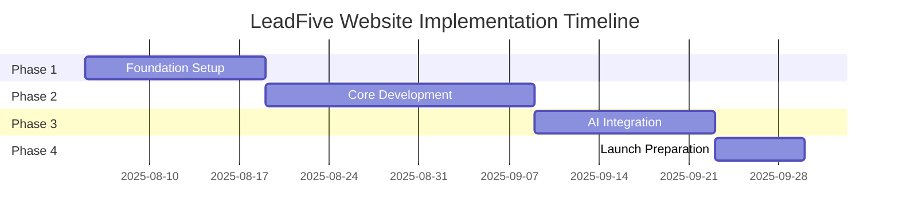

# Implementation Roadmap - LeadFive Website

## Executive Summary

This roadmap outlines the phased implementation approach for the LeadFive website renewal project, spanning 8 weeks from project initiation to production launch.

## Project Timeline Overview

## Phase 1: Foundation Setup (Weeks 1-2)

### Week 1: Project Initialization

#### Day 1-2: Environment Setup
- [ ] Initialize Next.js 14 project with TypeScript
- [ ] Configure ESLint, Prettier, and Husky
- [ ] Set up Git repository and branching strategy
- [ ] Configure Vercel project
- [ ] Set up development environment documentation

**Deliverables:**
- Initialized project repository
- Development environment guide
- CI/CD pipeline foundation

#### Day 3-4: Design System Setup
- [ ] Configure Tailwind CSS with custom theme
- [ ] Create color palette and typography system
- [ ] Set up component library structure
- [ ] Implement base UI components (Button, Card, Modal)
- [ ] Create Storybook for component documentation

**Deliverables:**
- Design system documentation
- Base component library
- Storybook instance

#### Day 5: WordPress Setup
- [ ] Install WordPress on WP Engine
- [ ] Configure headless setup
- [ ] Install necessary plugins (ACF, WPGraphQL, etc.)
- [ ] Create custom post types and taxonomies
- [ ] Set up API authentication

**Deliverables:**
- Headless WordPress instance
- API documentation
- Content structure definition

### Week 2: Infrastructure & Architecture

#### Day 6-7: API Architecture
- [ ] Implement WordPress API client
- [ ] Create data transformation layer
- [ ] Set up caching strategy
- [ ] Implement error handling
- [ ] Create API route structure

**Deliverables:**
- API client library
- Data models
- API route handlers

#### Day 8-9: State Management & Security
- [ ] Configure Zustand store
- [ ] Implement authentication system
- [ ] Set up security middleware
- [ ] Configure rate limiting
- [ ] Implement CSRF protection

**Deliverables:**
- State management system
- Security configuration
- Authentication flow

#### Day 10: Performance Foundation
- [ ] Configure image optimization
- [ ] Set up lazy loading
- [ ] Implement code splitting
- [ ] Configure caching headers
- [ ] Set up monitoring

**Deliverables:**
- Performance optimization config
- Monitoring dashboard
- Baseline metrics

## Phase 2: Core Development (Weeks 3-5)

### Week 3: Homepage Development

#### Day 11-12: Hero Section
- [ ] Implement 3D brain network visualization
- [ ] Create animated hero content
- [ ] Add responsive design
- [ ] Implement CTA buttons
- [ ] Add scroll indicators

**Deliverables:**
- Completed hero section
- 3D animation component
- Mobile-responsive design

#### Day 13-14: Desire Octagon Section
- [ ] Create interactive octagon component
- [ ] Implement hover/click interactions
- [ ] Add detail panel animations
- [ ] Create mobile touch gestures
- [ ] Add accessibility features

**Deliverables:**
- Interactive desire visualization
- Animation system
- Touch-friendly interface

#### Day 15: AI Innovation Section
- [ ] Design feature cards
- [ ] Implement scroll animations
- [ ] Create interactive demos
- [ ] Add responsive grid
- [ ] Optimize performance

**Deliverables:**
- AI features showcase
- Interactive demonstrations
- Optimized animations

### Week 4: Content & Features

#### Day 16-17: Blog Integration
- [ ] Create blog listing page
- [ ] Implement post detail page
- [ ] Add category filtering
- [ ] Create search functionality
- [ ] Implement pagination

**Deliverables:**
- Blog system
- Search functionality
- Category management

#### Day 18-19: Case Studies
- [ ] Design case study cards
- [ ] Create detail pages
- [ ] Add success metrics
- [ ] Implement carousel
- [ ] Add testimonials

**Deliverables:**
- Case studies section
- Metrics visualization
- Client testimonials

#### Day 20: Contact System
- [ ] Create contact form
- [ ] Implement validation
- [ ] Add email integration
- [ ] Create success flows
- [ ] Add analytics tracking

**Deliverables:**
- Contact form system
- Email notifications
- Conversion tracking

### Week 5: Polish & Optimization

#### Day 21-22: Responsive Design
- [ ] Complete mobile optimization
- [ ] Fix responsive issues
- [ ] Test on real devices
- [ ] Optimize touch interactions
- [ ] Improve mobile performance

**Deliverables:**
- Fully responsive site
- Device test report
- Performance metrics

#### Day 23-24: SEO Implementation
- [ ] Add meta tags system
- [ ] Implement structured data
- [ ] Create XML sitemap
- [ ] Add Open Graph tags
- [ ] Optimize page titles

**Deliverables:**
- SEO implementation
- Sitemap generation
- Social media cards

#### Day 25: Accessibility Audit
- [ ] Run accessibility tests
- [ ] Fix WCAG compliance issues
- [ ] Add ARIA labels
- [ ] Test with screen readers
- [ ] Document accessibility features

**Deliverables:**
- Accessibility report
- WCAG compliance
- Screen reader support

## Phase 3: AI Integration (Weeks 6-7)

### Week 6: AI Features

#### Day 26-27: Chat Integration
- [ ] Implement AI chat UI
- [ ] Connect OpenAI API
- [ ] Add streaming responses
- [ ] Implement context management
- [ ] Add error handling

**Deliverables:**
- AI chat interface
- API integration
- Context management

#### Day 28-29: Content Generation
- [ ] Create blog automation system
- [ ] Implement content generation API
- [ ] Add image generation
- [ ] Create review workflow
- [ ] Set up scheduling

**Deliverables:**
- Auto-blogging system
- Content generation pipeline
- Review interface

#### Day 30: AI Analytics
- [ ] Implement usage tracking
- [ ] Create cost monitoring
- [ ] Add performance metrics
- [ ] Create admin dashboard
- [ ] Set up alerts

**Deliverables:**
- Analytics dashboard
- Cost tracking
- Alert system

### Week 7: Testing & Refinement

#### Day 31-32: Integration Testing
- [ ] Test all API integrations
- [ ] Verify data flows
- [ ] Test error scenarios
- [ ] Check performance
- [ ] Document issues

**Deliverables:**
- Test results
- Bug reports
- Performance analysis

#### Day 33-34: User Acceptance Testing
- [ ] Conduct UAT sessions
- [ ] Gather feedback
- [ ] Prioritize fixes
- [ ] Implement changes
- [ ] Re-test critical paths

**Deliverables:**
- UAT feedback report
- Priority fix list
- Updated features

#### Day 35: Performance Optimization
- [ ] Run Lighthouse audits
- [ ] Optimize Core Web Vitals
- [ ] Reduce bundle size
- [ ] Improve load times
- [ ] Cache optimization

**Deliverables:**
- Performance report
- Optimization results
- Speed improvements

## Phase 4: Launch Preparation (Week 8)

### Day 36-37: Production Setup
- [ ] Configure production environment
- [ ] Set up SSL certificates
- [ ] Configure CDN
- [ ] Set up monitoring
- [ ] Create backup systems

**Deliverables:**
- Production environment
- Security configuration
- Monitoring setup

### Day 38-39: Final Testing
- [ ] Run E2E tests
- [ ] Security scanning
- [ ] Load testing
- [ ] Cross-browser testing
- [ ] Mobile testing

**Deliverables:**
- Test reports
- Security audit
- Performance baseline

### Day 40: Launch Day
- [ ] Deploy to production
- [ ] DNS configuration
- [ ] Monitor launch
- [ ] Run smoke tests
- [ ] Team standby

**Deliverables:**
- Live website
- Launch report
- Monitoring data

## Resource Requirements

### Team Composition
- **Project Manager**: 1 (part-time)
- **Frontend Developer**: 2 (full-time)
- **Backend Developer**: 1 (full-time)
- **UI/UX Designer**: 1 (part-time)
- **QA Engineer**: 1 (part-time)
- **DevOps Engineer**: 1 (part-time)

### Technology Stack
- Next.js 14
- TypeScript
- Tailwind CSS
- WordPress (Headless)
- OpenAI API
- Vercel
- Cloudflare

### Budget Estimates
- **Development**: $40,000 - $60,000
- **Infrastructure**: $500/month
- **AI Services**: $200-500/month
- **Third-party Services**: $200/month
- **Total Project Cost**: $45,000 - $65,000

## Risk Management

### Technical Risks
| Risk | Impact | Probability | Mitigation |
|------|--------|-------------|------------|
| API Rate Limits | High | Medium | Implement caching, queuing |
| Performance Issues | High | Low | Progressive enhancement |
| Browser Compatibility | Medium | Low | Thorough testing |
| Security Vulnerabilities | High | Low | Regular audits |

### Business Risks
| Risk | Impact | Probability | Mitigation |
|------|--------|-------------|------------|
| Scope Creep | High | Medium | Clear requirements, change control |
| Budget Overrun | Medium | Low | Regular monitoring, buffer |
| Timeline Delay | Medium | Medium | Agile approach, prioritization |
| User Adoption | Medium | Low | User testing, feedback loops |

## Success Criteria

### Technical Metrics
- [ ] Lighthouse score > 95
- [ ] Load time < 2 seconds
- [ ] Zero critical security issues
- [ ] 99.9% uptime
- [ ] Mobile responsive on all devices

### Business Metrics
- [ ] Launch on schedule
- [ ] Within budget (+/- 10%)
- [ ] All features functional
- [ ] Positive user feedback
- [ ] SEO rankings maintained/improved

## Communication Plan

### Weekly Meetings
- **Monday**: Sprint planning
- **Wednesday**: Progress check
- **Friday**: Demo & retrospective

### Stakeholder Updates
- Weekly email summaries
- Bi-weekly demo sessions
- Monthly steering committee

### Documentation
- Daily standup notes
- Weekly progress reports
- Risk register updates
- Decision log maintenance

## Post-Launch Plan

### Week 1 Post-Launch
- Monitor performance metrics
- Address critical issues
- Gather user feedback
- Optimize based on data

### Month 1 Post-Launch
- Implement enhancement requests
- Optimize AI costs
- Improve conversion rates
- Plan Phase 2 features

### Ongoing Maintenance
- Security updates
- Performance optimization
- Content updates
- Feature enhancements

---

**Document Version**: 1.0  
**Date**: 2025-08-05  
**Status**: Implementation Roadmap  
**Next Review**: Week 2 Checkpoint