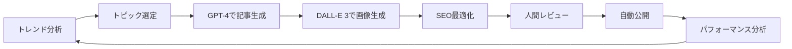

# LeadFive Website Renewal Concept - 人間の根源的欲求×AI革新

## コンセプト概要

### ビジョン
「人間の根源的な８つの欲求を理解し、AIの力で革新的なビジネスソリューションを創造する」

### ミッション
- 人間心理の深層を理解したマーケティング戦略
- AI技術を活用した斬新なビジネスアイディアの実現
- クライアントのビジネスを次のステージへ導く

## サイト構成

### 1. トップページ（LP型）- React/Next.js
革新的でインパクトのあるランディングページとして設計

### 2. ブログページ（CMS）- WordPress + AI
AIを活用した自動記事生成と配信システム

## トップページ設計案

### ヒーローセクション
```
タイトル: "人の本能を科学し、AIで未来を創る"
サブタイトル: "8つの根源的欲求×最先端AI = ビジネス革新"

ビジュアル: 
- 人間の脳とAIネットワークが融合するアニメーション
- パーティクルエフェクトで神経シナプスを表現
```

### 8つの根源的欲求セクション
インタラクティブな八角形のダイアグラムで表現：

1. **生存欲求** - セキュリティとリスク管理
2. **食欲** - 消費行動と満足度
3. **性欲** - 魅力とアトラクション
4. **睡眠欲求** - 快適性と回復
5. **逃避欲求** - ストレス解消とエンターテインメント
6. **恐怖** - 安心と信頼の構築
7. **闘争欲求** - 競争と達成感
8. **群居欲求** - コミュニティと帰属意識

### AI革新セクション
```
タイトル: "AIが可能にする3つの革新"

1. 予測的パーソナライゼーション
   - 顧客の潜在欲求をAIが予測
   - 最適なタイミングでのアプローチ

2. 創造的問題解決
   - GPTとの協働による斬新なアイディア生成
   - 人間の創造性×AIの処理能力

3. 自動化された成長
   - マーケティングの自動最適化
   - 24時間365日の改善サイクル
```

### 実績・ケーススタディ
```
カード型レイアウト:
- クライアントA: 売上300%向上
- クライアントB: 顧客満足度95%達成
- クライアントC: 新規事業立ち上げ成功
```

### CTAセクション
```
メイン: "無料相談を予約する"
サブ: "AIマーケティング診断を受ける"
```

## 技術スタック提案

### フロントエンド（トップページ）
```javascript
{
  "framework": "Next.js 14",
  "styling": "Tailwind CSS + Framer Motion",
  "animations": "Three.js / React Three Fiber",
  "state": "Zustand",
  "deployment": "Vercel",
  "features": {
    "ai_chat": "Vercel AI SDK",
    "analytics": "Google Analytics 4 + Mixpanel",
    "a11y": "React Aria",
    "performance": "Next.js Image Optimization"
  }
}
```

### バックエンド（ブログシステム）
```yaml
cms:
  platform: "WordPress (Headless)"
  hosting: "WP Engine or Kinsta"
  
ai_integration:
  content_generation: "OpenAI GPT-4"
  image_generation: "DALL-E 3"
  seo_optimization: "Yoast AI"
  
automation:
  scheduler: "WP Cron + Custom AI Pipeline"
  topics: "Trend Analysis API"
  publishing: "Auto-publish with review"
```

## AI自動ブログシステム設計

### コンテンツ生成フロー


### ブログカテゴリー案
1. **人間心理とマーケティング**
   - 8つの欲求深掘り記事
   - 心理学的アプローチ事例

2. **AI活用事例**
   - 最新AI技術の解説
   - ビジネス応用方法

3. **成功事例分析**
   - クライアント成功ストーリー
   - 業界別ベストプラクティス

4. **未来予測**
   - AIが変える業界予測
   - 次世代マーケティング手法

## デザインコンセプト

### カラーパレット
```css
:root {
  --primary: #6366F1;      /* Electric Indigo - AI/Tech */
  --secondary: #EC4899;    /* Hot Pink - Human/Emotion */
  --accent: #10B981;       /* Emerald - Growth/Success */
  --dark: #111827;         /* Near Black - Sophistication */
  --light: #F9FAFB;        /* Off White - Clean */
}
```

### タイポグラフィ
- 見出し: "Inter" or "Montserrat" - モダンで読みやすい
- 本文: "Noto Sans JP" - 日本語対応
- アクセント: "Space Grotesk" - テクノロジー感

### アニメーション戦略
1. **スクロールトリガー**
   - 要素のフェードイン
   - パララックス効果
   - カウントアップ数値

2. **インタラクティブ要素**
   - ホバーエフェクト
   - クリック反応
   - マイクロインタラクション

3. **AI体験**
   - チャットボット
   - リアルタイム提案
   - パーソナライズコンテンツ

## 実装ロードマップ

### Phase 1: 基盤構築（2週間）
- [ ] Next.jsプロジェクトセットアップ
- [ ] デザインシステム構築
- [ ] WordPress環境構築
- [ ] 基本レイアウト実装

### Phase 2: コア機能（3週間）
- [ ] ヒーローセクション実装
- [ ] 8つの欲求インタラクティブ図
- [ ] AI機能セクション
- [ ] レスポンシブ対応

### Phase 3: AI統合（2週間）
- [ ] GPT-4 API統合
- [ ] 自動記事生成システム
- [ ] AIチャットボット実装
- [ ] 分析ダッシュボード

### Phase 4: 最適化（1週間）
- [ ] パフォーマンス最適化
- [ ] SEO対策
- [ ] A/Bテスト設定
- [ ] 本番環境デプロイ

## 差別化ポイント

### 1. 心理学×テクノロジーの融合
- 学術的裏付けのあるアプローチ
- データドリブンな意思決定
- 人間中心のAI活用

### 2. 実践的なコンテンツ
- 理論だけでなく実例重視
- すぐに使えるフレームワーク提供
- ROIが見える提案

### 3. 継続的な価値提供
- AI自動更新ブログ
- 最新トレンド情報
- 無料診断ツール

## 成功指標（KPI）

### ウェブサイト指標
- 月間訪問者数: 10,000人以上
- 平均滞在時間: 3分以上
- コンバージョン率: 5%以上
- ブログ購読者: 1,000人以上

### ビジネス指標
- 月間問い合わせ: 50件以上
- 新規クライアント: 月5社
- 顧客満足度: 90%以上
- リピート率: 80%以上

## 技術的な実装例

### ヒーローセクションのアニメーション
```jsx
// React Three Fiber を使った脳×AIネットワークビジュアル
import { Canvas } from '@react-three/fiber'
import { OrbitControls, Sphere, MeshDistortMaterial } from '@react-three/drei'

function BrainAIVisual() {
  return (
    <Canvas>
      <ambientLight intensity={0.5} />
      <pointLight position={[10, 10, 10]} />
      
      {/* 脳を表現する歪んだ球体 */}
      <Sphere args={[1, 100, 200]} scale={2.5}>
        <MeshDistortMaterial
          color="#6366F1"
          attach="material"
          distort={0.3}
          speed={1.5}
          roughness={0.2}
        />
      </Sphere>
      
      {/* AIネットワークのパーティクル */}
      <ParticleNetwork />
      
      <OrbitControls enableZoom={false} />
    </Canvas>
  )
}
```

### 8つの欲求インタラクティブ図
```jsx
// Framer Motion を使った八角形ダイアグラム
import { motion } from 'framer-motion'

const desires = [
  { id: 1, name: '生存', color: '#EF4444', description: 'セキュリティへの欲求' },
  { id: 2, name: '食欲', color: '#F97316', description: '満足と充実への欲求' },
  // ... 他の6つ
]

function DesireOctagon() {
  const [selected, setSelected] = useState(null)
  
  return (
    <div className="relative w-96 h-96">
      {desires.map((desire, index) => {
        const angle = (index * 45) * Math.PI / 180
        const x = Math.cos(angle) * 150
        const y = Math.sin(angle) * 150
        
        return (
          <motion.div
            key={desire.id}
            className="absolute w-20 h-20 rounded-full cursor-pointer"
            style={{
              backgroundColor: desire.color,
              left: `calc(50% + ${x}px - 40px)`,
              top: `calc(50% + ${y}px - 40px)`,
            }}
            whileHover={{ scale: 1.2 }}
            onClick={() => setSelected(desire)}
          >
            <span className="text-white font-bold">{desire.name}</span>
          </motion.div>
        )
      })}
    </div>
  )
}
```

### AI自動ブログ生成
```python
# WordPress + OpenAI Integration
import openai
import requests
from datetime import datetime
import schedule

class AIBlogGenerator:
    def __init__(self):
        self.openai_key = "your-key"
        self.wp_url = "https://blog.leadfive138.com/wp-json/wp/v2"
        self.wp_auth = ("username", "app_password")
    
    def generate_article(self, topic):
        # トピックに基づいて記事を生成
        prompt = f"""
        以下のトピックについて、マーケティングコンサルタントの視点から
        人間の根源的欲求とAIの活用を絡めた記事を書いてください：
        
        トピック: {topic}
        文字数: 2000-3000字
        トーン: プロフェッショナルだが親しみやすい
        構成: 導入、問題提起、解決策（AI活用）、事例、まとめ
        """
        
        response = openai.ChatCompletion.create(
            model="gpt-4",
            messages=[{"role": "user", "content": prompt}]
        )
        
        return response.choices[0].message.content
    
    def generate_featured_image(self, title):
        # DALL-E 3で記事のアイキャッチ画像を生成
        response = openai.Image.create(
            model="dall-e-3",
            prompt=f"Modern, professional blog header image for: {title}. Style: minimalist, tech-focused, purple and pink gradient",
            size="1792x1024",
            quality="hd"
        )
        
        return response.data[0].url
    
    def publish_to_wordpress(self, title, content, image_url):
        # WordPressに記事を投稿
        post_data = {
            "title": title,
            "content": content,
            "status": "draft",  # レビュー後に公開
            "categories": [1],  # AIマーケティングカテゴリ
            "featured_media": self.upload_image(image_url)
        }
        
        response = requests.post(
            f"{self.wp_url}/posts",
            json=post_data,
            auth=self.wp_auth
        )
        
        return response.json()
    
    def daily_article_generation(self):
        # トレンドAPIから今日のトピックを取得
        trending_topic = self.get_trending_topic()
        
        # 記事生成
        article = self.generate_article(trending_topic)
        
        # 画像生成
        image = self.generate_featured_image(trending_topic)
        
        # 投稿
        self.publish_to_wordpress(trending_topic, article, image)

# スケジュール設定
schedule.every().day.at("09:00").do(blog_generator.daily_article_generation)
```

## まとめ

このウェブサイトリニューアル計画は、人間の根源的欲求という普遍的なテーマと、AIという最先端技術を融合させることで、他にはない独自のポジショニングを確立します。

トップページは訪問者に強烈な印象を与え、ブログは継続的な価値提供により、長期的な関係構築を実現します。

技術的には最新のフレームワークを活用しながら、人間中心のデザインを心がけることで、真に価値のあるウェブ体験を創造します。

---

Document Version: 1.0
Date: 2025年7月30日
Status: コンセプト提案